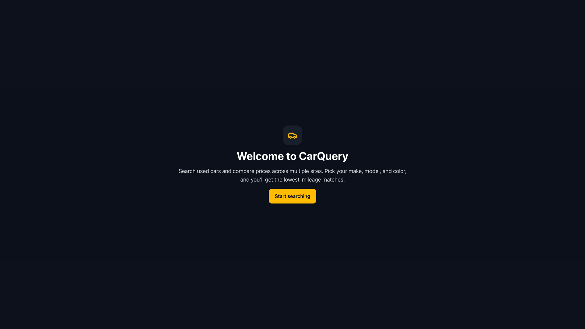
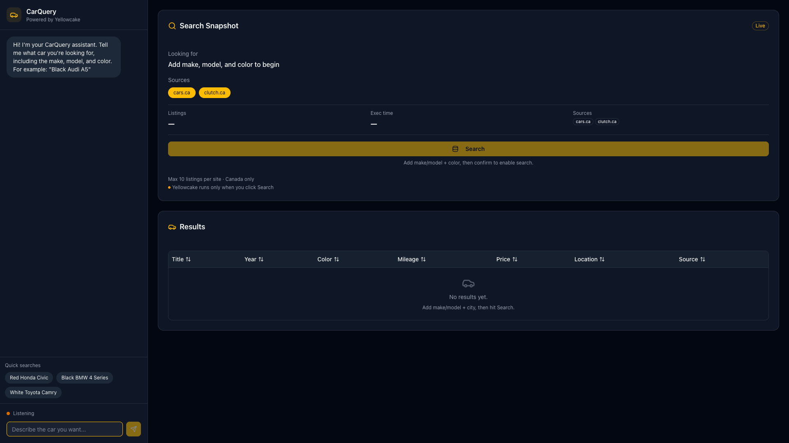

# CarQuery (uOttaHack 8)

CarQuery is a chat-based used-car search dashboard that pulls live listings from dealer sites using the Yellowcake API.”

## Quick start (local)

Requirements: Node 18+ and npm.

1) Clone this repo and `cd` into it.  
2) Install deps: `npm install`  
3) Create `.env.local` in the project root:

   ```bash
   YELLOWCAKE_API_KEY=your_yellowcake_api_key
   ```
   Get a key at https://yellowcake.dev (sign up, create an API key).
4) Run the app: `npm run dev`
5) Open `http://localhost:3000` → click **Start searching** to open `/search`.

## How it works

- Chat gathers make, model, and color; then asks you to confirm.  
- Clicking **Search** triggers a single Yellowcake request via the Next.js API route.  
- Results are normalized into a table with year, make/model, color, mileage, price, location, source, and a direct link.

## Notes

- Current sources: cars.ca (stable) and clutch.ca (can be slow).

## Preview

**Welcome screen**



**Search page**


